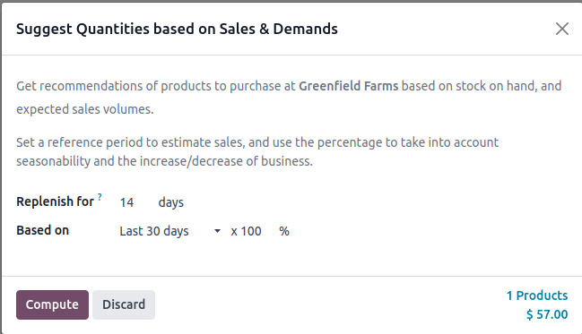
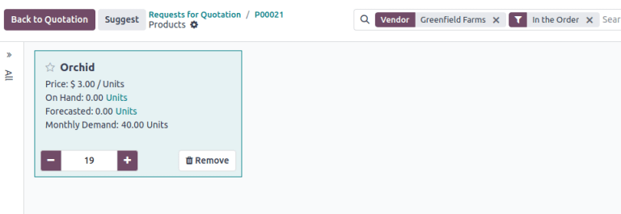
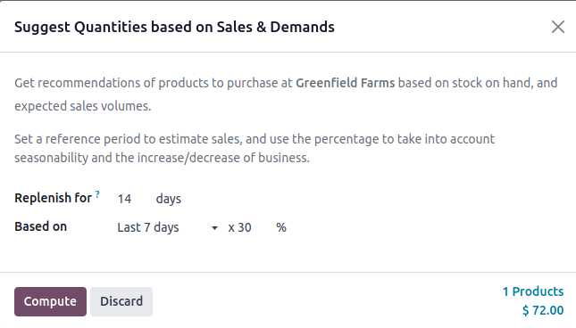
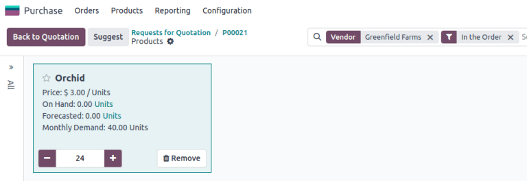

=============================================
Suggest quantities based on historical demand
=============================================

.. |RFQ| replace:: :abbr:`RFQ (request for quotation)`

For businesses requiring a straightforward push-based replenishment strategy, reordering rules or
master production schedules can be excessive. The *Suggest* feature offers a straightforward method
for creating purchase orders (POs) or requests for quotations (RFQs) with recommended quantities
drawn from historical demand. Ensures adequate inventory for upcoming needs over a chosen period
without complex configuration.

Overview
========

Calculates average daily demand for products from historical delivery data, then multiplies that
demand by a selected number of days to determine recommended purchase quantities. The time frame for
calculating average daily demand and the total replenishment period are both configurable.

Key parameters:

- *Replenish for*: The number of days in advance to replenish stock.
- *Based on*: Determines the historical period the system uses to calculate average demand.

The *Based on* field can be set to :guilabel:`Last 7 days`, :guilabel:`Last 30 days`,
:guilabel:`Last 3 months`, or :guilabel:`Last 12 months`, with additional options for referencing
the same month or quarter from a previous year.

For example, if the current month is April 2025, available choices include April 2024, May 2024,
June 2024, or April to June 2024. The system then computes average daily demand based on validated
deliveries within the chosen window.

Prerequisites
-------------

To use this feature, the **Purchase** and **Inventory** apps must be installed.

In order to compute suggestions, the system needs:

#. Validated delivery orders

  Historical sales or delivery data is required. Each product must have at least one validated
  delivery.

#. Vendor pricelist configuration

   Each product must list a vendor in the vendor pricelist, ensuring the system recognizes a
   supplier with a defined purchase price.

#. Quantity tracking

    Each product must be tracked by quantity so the system can translate demand into recommended
    quantities.

Suggest quantities to order
===========================

To suggest quantities based on past sales, navigate to the :menuselection:`Purchase` app. Create a
:guilabel:`New` request for quotation (RFQ) or select an existing one.

In the |RFQ|, set the :guilabel:`Vendor` field to the chosen supplier.

In the :guilabel:`Products` tab, add desired products. Each product **must** include the same vendor
in its vendor pricelist.

Clicking :guilabel:`Catalog` in the :guilabel:`Products` tab displays the catalog of selected
products from the |RFQ|.

.. important::
   Verify that each product in the catalog is configured with the chosen vendor.

Within the :guilabel:`Catalog`, click the :guilabel:`Suggest` button to open the :guilabel:`Suggest
Quantities based on Sales & Demands` pop-up window, where the suggestion parameters are specified:

- :guilabel:`Replenish for`: Number of days intended to stock products
- :guilabel:`Based on`: Historical period used to calculate average daily demand (e.g.,
  :guilabel:`Last 30 Days`, :guilabel:`April 2024`)

- :guilabel:`Percentage`: Portion of historical demand to apply (e.g., 100%, 30%)

Once the parameters are confirmed, click :guilabel:`Compute` to calculate recommended quantities,
which are auto-filled in each product's quantities in the catalog. Adjust amounts if needed, then
click :guilabel:`Back to Quotation` to confirm the final numbers on the |RFQ|.

Example 1
---------

A company needs to replenish orchids for 14 days, referencing the last 30 days of historical data at
100% capacity.

Historical Data:

- 20 units delivered 15 days ago in a `WH/OUT` operation.
- 20 units delivered 1 day ago
- Total: 40 units in the last 30 days

.. math::

   Average~Daily~Demand = 40 \divide 30 \approx 1.33 \text{units/day}

Over 14 days, at 100% of historical demand, the system suggests:

.. math::

   Suggested~Quantity = 1.33 \times 14 \approx 18.67 \text{rounded to 19 units}

   Suggestion to purchase 19 orchids.

Example 2
---------

Scenario: The company needs to replenish orchids for the next 14 days, looking at the last 7 days of
historical data at 30% capacity.

Historical Data:

- 20 units delivered 5 days ago
- 20 units delivered 2 days ago
- Total: 40 units in the last 7 days

This implies a total of 80 units sold in 14 days. Dividing 40 units by 14 yields an average daily
demand of 5.71 units/day (approximately).

.. math::

   Average~Daily~Demand = 40 \divide 14 \approx 5.71 \text{units/day}

Over 14 days, at 30% of historical demand, the system suggests:

.. math::

   Suggested~Quantity = 5.71 \times 14 \times 0.3 = 23.98 \text{rounded to 24 units}

   Suggestion to purchase 24 orchids.

Best practices
==============

#. Validate Historical Data

   Use accurate delivery orders to avoid incorrect forecasts. Suggested quantities rely on the
   *Scheduled Date* on the delivery order.

   .. image:: suggest/scheduled-date.png
      :alt: Example of scheduled date field.

#. Maintain Accurate Vendor Pricelists:

   Review and update vendor pricelists to reflect the latest pricing and supplier information to
   ensure correct suggestions.

#. Adjust for Seasonality:

   Reference prior months or quarters to capture seasonal fluctuations.

#. Review Suggestions Critically:

   Although the tool provides a baseline recommendation, always apply business judgment. Market
   changes, promotions, and upcoming events can affect actual demand.
